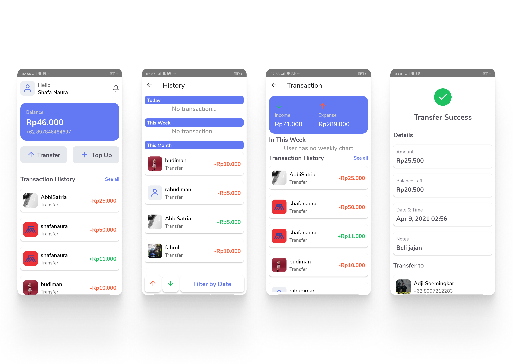

# About
Digital wallet application that can make transactions in real time with the help of the socket.io package. There are many features available in this application such as transaction history, charts, income expense, and several others. This application has also been integrated with push notifications via Firebase. so that users will get notifications when there is an incoming transaction.

# More Information
Repo Backend : bit.ly/3mAmvvf  
Demo app : bit.ly/322ABfK  
Screenshot : bit.ly/3szUqpd

